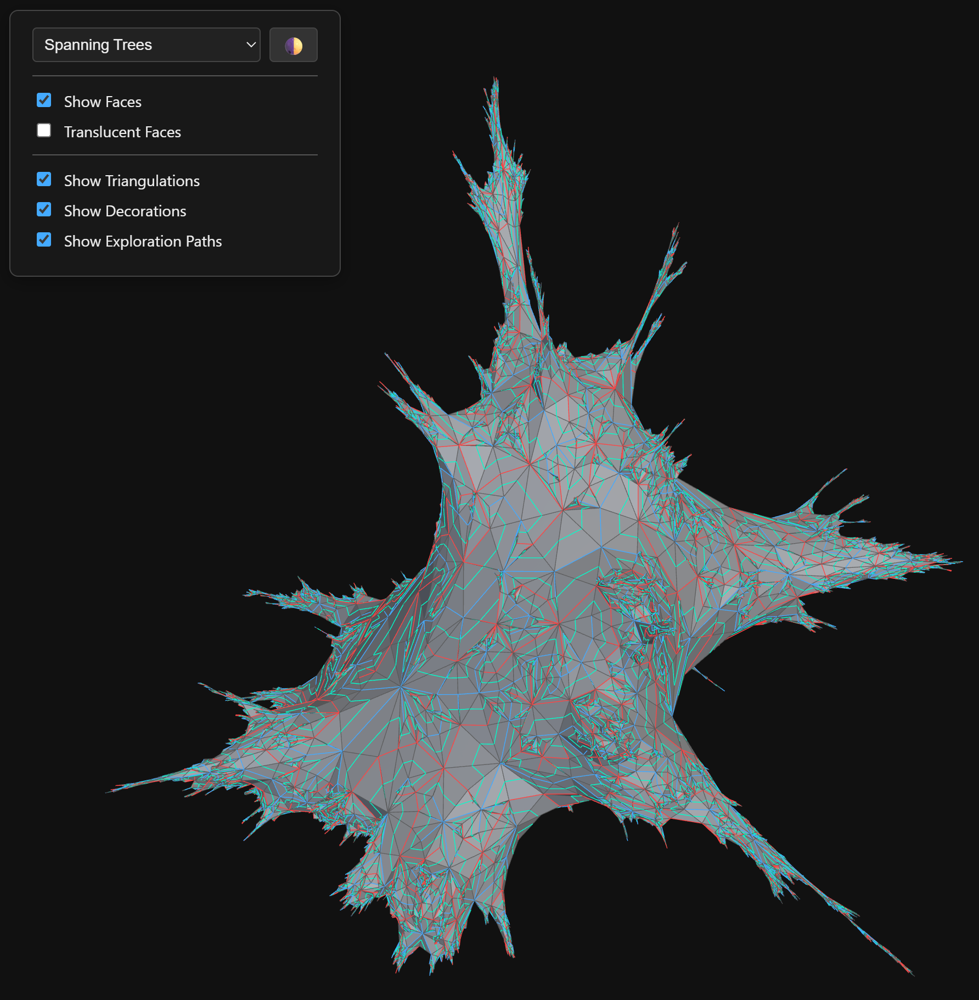

# DecoratedRandomPlanarMaps.jl

`DecoratedRandomPlanarMaps.jl` is a high-performance Julia package for sampling decorated random planar maps, computing 2D or 3D layouts, and exporting results for web visualization, publication (SVG), or 3D printing (STL).

It provides a streamlined programmatic pipeline for exploring random geometry:

  - Generate a map from a chosen model
  - Construct a model-specific layout problem
  - Compute a 2D (Tutte/circle-packing) or 3D (SFDP) layout
  - Export or render the final geometry

The codebase is highly optimized for scale and speed. For example, computing the layout of a uniform quadrangulation with 500,000 faces takes approximately 5 minutes on a standard desktop machine.

[](https://aub.ie/randmaps)

<p align="center">
  <a href="https://aub.ie/randmaps">
    
  </a>
</p>

## Supported Models

The package currently supports four families of decorated random planar maps:
- `uniform` — uniform quadrangulations
- `schnyder` — Schnyder-wood-decorated triangulations
- `fk` — FK-decorated maps with parameter `q` (or `p` from the Hamburger-Cheeseburger bijection). For 2D layouts, the largest gasket is automatically utilized as the boundary.
- `spanning_tree` — the FK model in the special case where `p = 0`

**Note on FK Sampling Limitations:**
With the exception of the spanning tree case (`p = 0`), FK-decorated maps are not sampled exactly. Instead, they are approximated using a Markov Chain Monte Carlo (MCMC) algorithm. Users should be aware that the accuracy of this approximation currently degrades for larger values of `p`.

## Supported Layout Engines

- `tutte` — 2D harmonic embedding with fixed boundary vertices
- `circle_packing` — 2D circle packing for triangulated disk layout problems; it records both circle centers and radii so SVG, web, and Makie previews can draw the circles directly
- `sfdp` — 3D embedding via Graphviz `sfdp` when available, with a built-in force-layout fallback when Graphviz is not installed

**Future Implementations:**
- `mated_crt`— Mated-CRT (continuum-random-tree) maps
- `bipolar` — Bipolar-orientation-decorated maps
- `meandric` — Random geometry of meanders or meandric systems, including half-plane and uniform variants

**Feature Requests & Collaboration:**
I am open to implementing additional models and layout algorithms. Please feel free to [reach out via email](mailto:minjaep@auburn.edu) for assistance, feature requests, or research collaboration.

## Citation

If you use `DecoratedRandomPlanarMaps.jl` in your research or course materials, please cite it. A formal paper is currently in preparation. In the meantime, please cite the repository directly:

> Park, M. (2026). *DecoratedRandomPlanarMaps.jl: A Julia package for sampling and rendering decorated random planar maps*. GitHub repository. [https://github.com/MinjaePark-Math/DecoratedRandomPlanarMaps.jl](https://github.com/MinjaePark-Math/DecoratedRandomPlanarMaps.jl)

```bibtex
@misc{Park_DecoratedRandomPlanarMaps_2026,
  author = {Park, Minjae},
  title = {DecoratedRandomPlanarMaps.jl: A Julia package for sampling and rendering decorated random planar maps},
  year = {2026},
  publisher = {GitHub},
  journal = {GitHub repository},
  howpublished = {\url{https://github.com/MinjaePark-Math/DecoratedRandomPlanarMaps.jl}}
}
```

## Installation

You can install the package directly from GitHub using the Julia package manager:

```julia
using Pkg
Pkg.add(url="https://github.com/MinjaePark-Math/DecoratedRandomPlanarMaps.jl")
```

**System Requirements**

- [Graphviz](https://graphviz.org/) is recommended for fast 3D layouts with the SFDP engine. If it is not installed or not available on `PATH`, the package falls back to a built-in `O(n^2)` force layout, which can be much slower on large examples.

**Optional Dependencies (Rendering)**
To enable the built-in Makie visualizers (`render_makie_2d` and `render_makie_3d`), you must also install `GLMakie` and `GeometryBasics` in your current environment. The package will automatically load its rendering extension when these are present, including when `run_pipeline(..., output.show = true)` opens a viewer.

```julia
using Pkg
Pkg.add(["GLMakie", "GeometryBasics"])
```

## Package structure

- `src/core` — shared interfaces, half-edge storage, sparse graph helpers, samplers, timings
- `src/models` — uniform, Schnyder, and FK / spanning-tree constructions
- `src/layout` — model-specific layout-problem preparation, Tutte, circle packing, and SFDP
- `src/render` — common geometry helpers, web export, SVG preview, STL export
- `ext` — optional GLMakie renderer extension
- `src/Pipeline.jl` — YAML/dict-driven end-to-end pipeline helpers
- `examples` — one script per model with all export blocks present and easy to comment out

## Core workflow

```julia
using DecoratedRandomPlanarMaps

map_data = generate_schnyder_map(; size_faces=200, seed=7)
problem = prepare_layout_problem(map_data; dimension=2)

pos, radii, meta = compute_circle_packing_layout(
    problem.num_vertices,
    problem.edges,
    problem.boundary_vertices;
    triangles=problem.surface_triangles,
    triangle_edge_ids=problem.surface_triangle_edge_ids,
    maxiter=120,
    return_metadata=true,
)

export_svg_preview(
    problem.render_map_data,
    pos,
    "exports/schnyder_circle_packing.svg";
    edge_groups=problem.edge_groups,
    faces=problem.faces,
    triangles=problem.surface_triangles,
    circle_radii=radii,
    metadata=merge(problem.metadata, meta),
)
```

For Tutte embeddings, call `compute_tutte_layout(...)` instead and omit `circle_radii`.

## Optional Makie rendering

The base package does not depend on Makie. The extension is loaded when `GLMakie` and `GeometryBasics` are available in the same Julia session.

```julia
using GLMakie
using GeometryBasics
using DecoratedRandomPlanarMaps

map_data = generate_schnyder_map(; size_faces=200, seed=7)
problem = prepare_layout_problem(map_data; dimension=2)
pos, _ = compute_tutte_layout(
    problem.num_vertices,
    problem.edges,
    problem.boundary_vertices;
    boundary_positions=problem.boundary_positions,
    return_metadata=true,
)

render_makie_2d(
    problem.render_map_data,
    pos;
    edge_groups=problem.edge_groups,
    faces=problem.faces,
    triangles=problem.surface_triangles,
    metadata=problem.metadata,
    title="Schnyder · 2D Makie",
)
```

## Config-driven pipeline without a CLI

The YAML pipeline is still available as a library helper:

```julia
using DecoratedRandomPlanarMaps
run_pipeline("configs/fk_h_gasket_2d.yaml")
```

or

```julia
using DecoratedRandomPlanarMaps
cfg = load_config("configs/uniform_3d.yaml")
run_pipeline(cfg)
```

## Examples

Use the `examples/` directory for copy-pasteable workflows:

- `examples/uniform_examples.jl`
- `examples/schnyder_examples.jl`
- `examples/fk_examples.jl`
- `examples/spanning_tree_examples.jl`
- `examples/circle_packing.jl`
- `examples/demo.jl`

Each example contains all relevant export blocks already written out:

- SVG preview
- Three.js web export
- STL export for 3D
- optional Makie render blocks

You can simply comment out any block you do not want.

## Documents

- `docs/RENDER_OPTIONS_NOTE.md` — renderer defaults, toggles, and color conventions
- `docs/CONFIG_OPTIONS.md` — pipeline/config keys and common options
- `examples/README.md` — how to run the example scripts

## License

* The source code in this repository is licensed under the [MIT License](LICENSE).
* All visualizations and images generated by DecoratedRandomPlanarMaps.jl are licensed under the [Creative Commons Attribution 4.0 International License (CC BY 4.0)](LICENSE-CC-BY).
